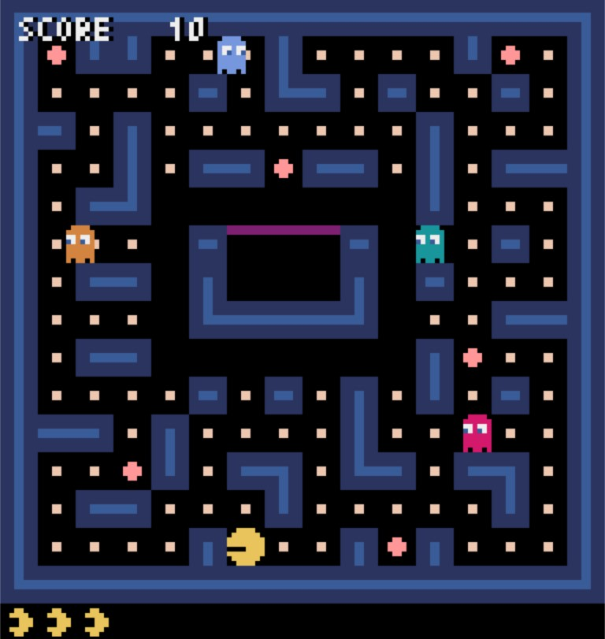

# PACMAN

A simple version of PACMAN

## Key-bind:
- move left: `←`
- move right: `→`
- move upward: `↑`
- move downward: `↓`

## score calculation:
- eat small pellets: 10 points;
- eat big pellets: 50 points; 
- eat ghosts: 100 points; 

###### Use [Pyxel](https://github.com/kitao/pyxel) as game engine